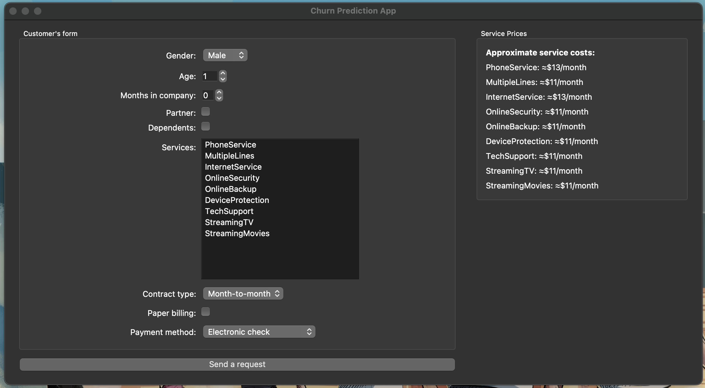
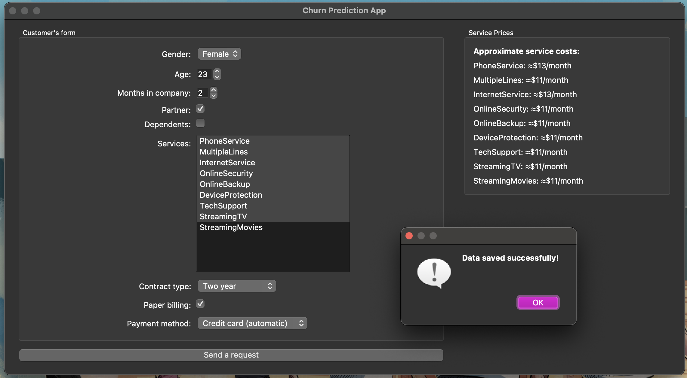
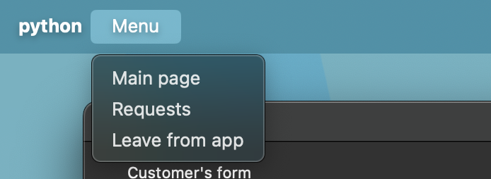
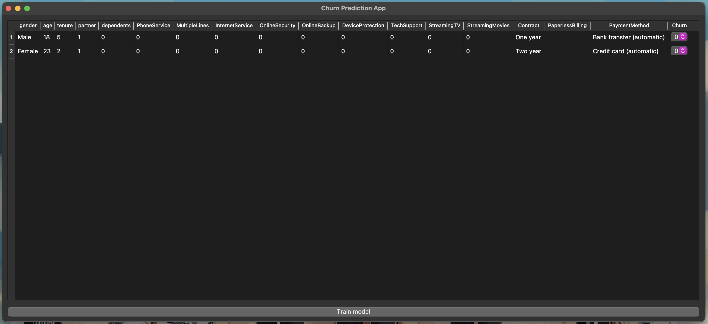
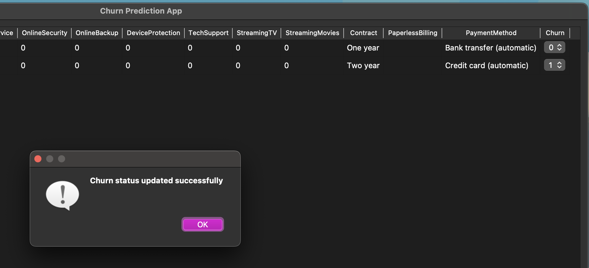
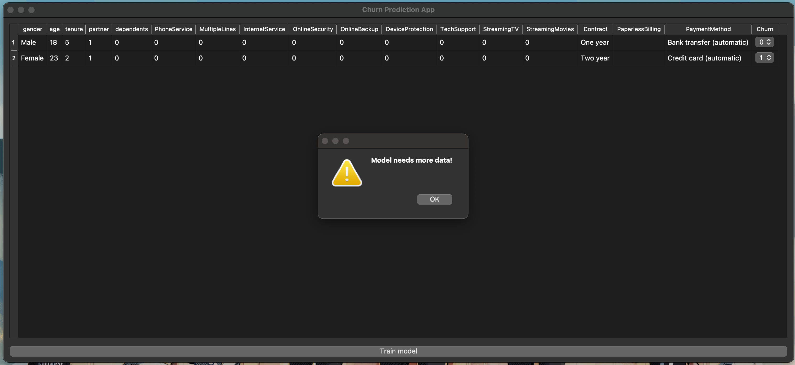

# Гайд и демонстрация созданного приложения

### Главная страница
На главной странице вы можете найти специальную форму, в которую можно вписать все важные данные о клиенте.

Здесь можно увидеть несколько полей, в которые можно занести информацию о клиенте и отправить данные в базу.

Данные были отправлены в базу, давайте посмотрим на другой странице, каких клиентов мы уже успели добавить

Для этого нам следует воспользоваться строкой меню и перейти на дополнительную страницу

### Дополнительная страница

На дополнительной странице мы можем увидеть большую таблицу с данными о внесенных клиентах.

Чтобы оспорить и изменить предсказание модели (если она, например, совершила ошибку в предсказании) просто можно изменить Churn выбрав для него новое значение в dropdown.

Чтобы провести тренировку модели, нужно нажать на соответсвующую кнопку (Если записей в таблице будет больше 500 > произойдет тренировка)

## Стоит отметить

После нового изменения таблица может проверяться автоматически с помощью Airflow (и обучаться в случае, если условие 500 строк удовлетворилось), после каждой тренировки данные таблицы стираются.